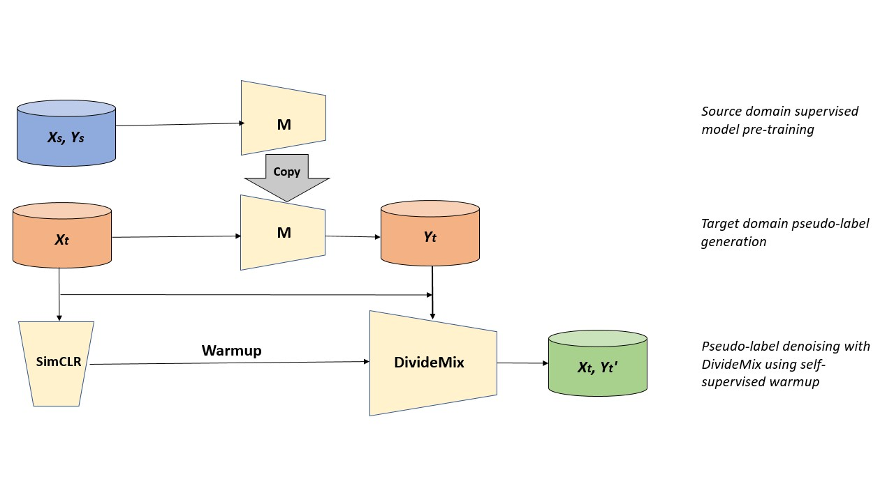
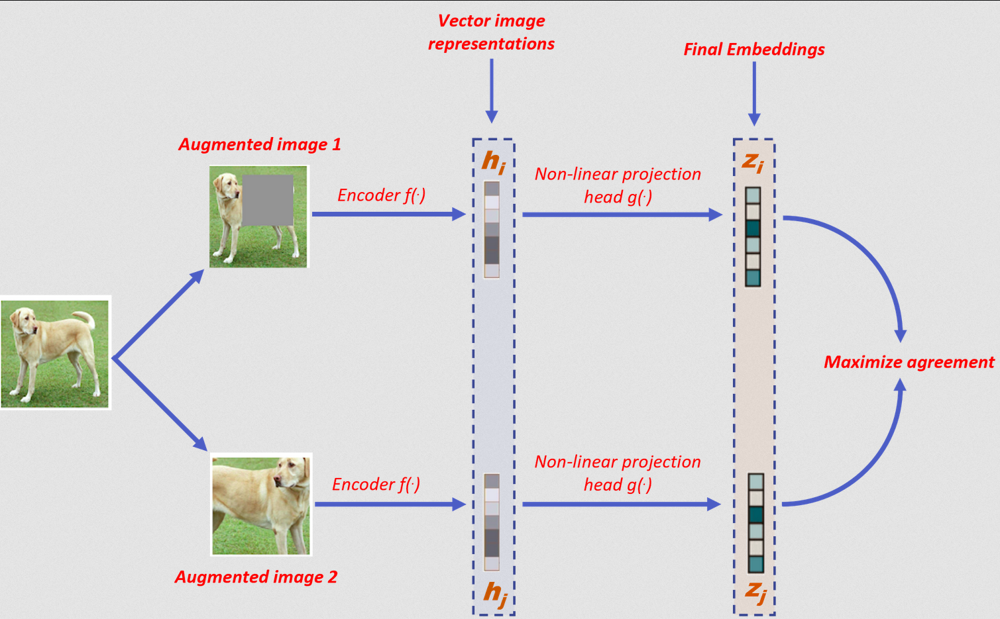
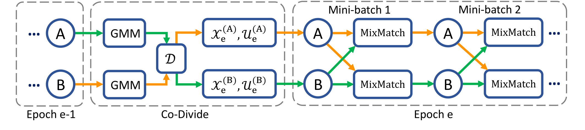

# Contrast to Adapt: Noisy Label Learning with Contrastive Warmup for Source-Free Unsupervised Domain Adaptation​

In  this  work  we  try  to  solve  the  problem  of  source-free  unsupervised  domain  adaptation(UDA), where we have access to pre-trained source data model and unlabelled target data to perform domain adaptation.  Source-free UDA is formulated as a noisy label learning prob-lem and solved using self-supervised noisy label learning (NLL) approaches.  The proposed method involves generating pseudo-labels on target dataset using a pre-trained model, fol-lowed by self-supervised learning of unlabeled target data with contrastive loss and NLL with DivideMix.  

### Overview of the proposed method


## 1. Training model on source and Noisy label generation
Using source data (Xs, Ys), we create pre-trained classification model f. Then, generate pseudo-labels (Yt) using the pre-trained model and unlabeled target data (Xt)
### Setup

1. Download datasets from follwing links:
    1. SVHN http://ufldl.stanford.edu/housenumbers/
    2. MNIST https://drive.google.com/file/d/1cZ4vSIS-IKoyKWPfcgxFMugw0LtMiqPf/view?usp=sharing
    3. USPS (in data folder) https://github.com/mil-tokyo/MCD_DA/tree/master/classification/data

2. Create a folder name 'data' and put all downloaded datasets in it


Pairs of dataset to be used:
* MNIST -> USPS
* USPS -> MNIST
* SVHN -> MNIST​

** use `--help` token with python file to know more about the parameters.

Training:
```
python train_model.py --source usps --target mnist --all_use yes 
```


Command for inference (noisy label generation):
```
python eval_model.py --source usps --target mnist --load_epoch 190 --save_json --all_use yes
```

* Trained models: https://drive.google.com/drive/folders/1hkTvyaBJWgbTGsR_Y5WaKTaOkvOWIMUK?usp=sharing

## 2. SimCLR on Target data
Self-supervised learning of unlabeled target data (Xt) with contrastive loss, using SimCLR. We use the encoder trained in an unsupervised fashion on the contrastive learning task to initialize the networks for DivideMix. 



Training:
```
conda activate simclr
python run.py -data ./datasets -dataset_name svhn --log-every-n-steps 5 --epochs 100
```

Change ```dataset_name``` flag as ```mnist```, ```svhn```, or ```usps``` for different datasets. 

* Trained models: https://drive.google.com/drive/folders/11C61TWc7SQTYGDXzsbVqO_W3PkETjhET?usp=sharing


## 3. DivideMix (Noisy label learning)
Learning with noisy labels using DivideMix, obtaining (Xt,Yt’). Warmup stage of DivideMix is initialized with SimCLR trained network from the previous step. The main component of the architecture of DivideMix are shown below.



<!-- 1. Save dataset under ```data/cifar-10``` -->
1. Place noisy label `.json` file in `noisy_labels` directory.
2. Save SimCLR model under ```pretrained``` folder
3. Training:
```
python3 main_cifar.py --num_epochs 1 --batch_size 4  --r 0.8 --lambda_u 500 --dataset mnist --p_threshold 0.03 --data_path ./noisy_labels --experiment-name simclr_resnet18 --method selfsup --net resnet50
```

## Results

### Inference on target dataset using pre-trained source model​

| Dataset (Source -> Target) | Accuracy (%) |
|----------------------------|--------------|
| MNIST -> USPS              | 71.95        |
| SVHN -> MNIST              | 60.28        |
| USPS -> MNIST              | 63.53        |

### Top-1 accuracy for SimCLR contrastive training

| Dataset | Architecture | Accuracy (%) |
|---------|--------------|--------------|
| MNIST   | resnet18     | 96.77        |
| USPS    | resnet18     | 81.54        |
| CIFAR10 | resnet18     | 99.80        |
| CIFAR10 | resnet50     | 99.61        |

### Accuracy for DivideMix (NLL)  training

| Dataset | Architecture | Accuracy (%) |
|---------|--------------|--------------|
| MNIST   | resnet18     | 96.77        |
| USPS    | resnet18     | 81.54        |
| CIFAR10 | resnet18     | 99.80        |
| CIFAR10 | resnet50     | 99.61        |

### Ablation Study for DivideMix. Training DivideMix with self (MNIST, USPS) and external data (CIFAR10)-based SimCLR warmup 

| UDA Task      | SimCLR  | Architecture | Accuracy (%) |
|---------------|---------|--------------|--------------|
| MNIST -> USPS | USPS    | resnet18     | 94.36        |
| SVHN -> MNIST | MNIST   | resnet18     | 90.85        |
| USPS -> MNIST | MNIST   | resnet18     | 90.59        |
| MNIST -> USPS | CIFAR10 | resnet18     | 98.06        |
| SVHN -> MNIST | CIFAR10 | resnet18     | 94.04        |
| USPS -> MNIST | CIFAR10 | resnet18     | 91.81        |
| MNIST -> USPS | CIFAR10 | resnet50     | 97.41        |
| SVHN -> MNIST | CIFAR10 | resnet50     | 92.57        |
| USPS -> MNIST | CIFAR10 | resnet50     | 91.17        |


### Performance of our method on digits datasets compared to other state-of-the-art methods. 
| Methods                  | Source | MNIST -> USPS | SVHN -> MNIST | USPS -> MNIST |
|--------------------------|:------:|---------------|---------------|---------------|
| CDAN [6]                 |    ✓   | 95.6          | 89.2          | 98.0          |
| ADR [7]                  |    ✓   | 93.2          | 95.0          | 96.1          |
| MCD [8]                  |    ✓   | 96.5          | 96.2          | 94.1          |
| STAR [9]                 |    ✓   | 97.8          | 98.8          | 97.7          |
| SHOT [10]                |    ✕   | 97.9          | 98.9          | 98.2          |
| SSNLL [1]                |    ✕   | 97.1          | 99.3          | 98.8          |
| SSNLL (no preprocessing) |    ✕   | ~57           | ~93           | ~70           |
| Pre-trained Source Model |    -   | 71.95         | 60.28         | 63.53         |
| Contrast to Adapt (OURS) |    ✕   | 98.04         | 94.04         | 91.81         |

Our result is reported as average of three repetitions. ✓ denotes source-based UDA and ✕ denotes source-free UDA. The best results for each task has been highlighted in bold. ​

## Contributors
 
This code has been written for the High Level Computer Vision (HLCV) course project at Saarland University for Summer Semester 2021. Following are the contributors:

- [Arpit Jadon](https://github.com/arpit-jadon) (Student Number: 7010483)
- [Nikhil Paliwal](https://github.com/nik1806) (Student Number: 7009915)
- [Sohom Mukherjee](https://github.com/mukherjeesohom) (Student Number: 7010515)

